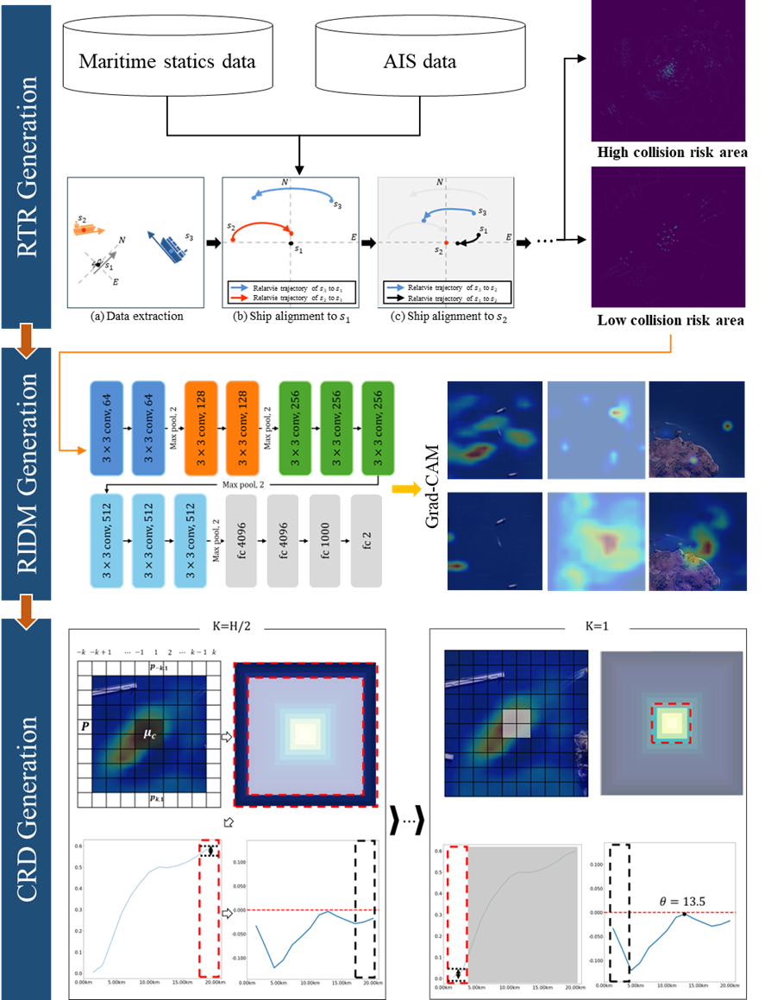
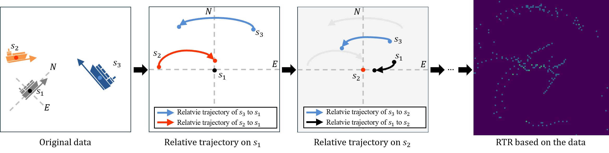
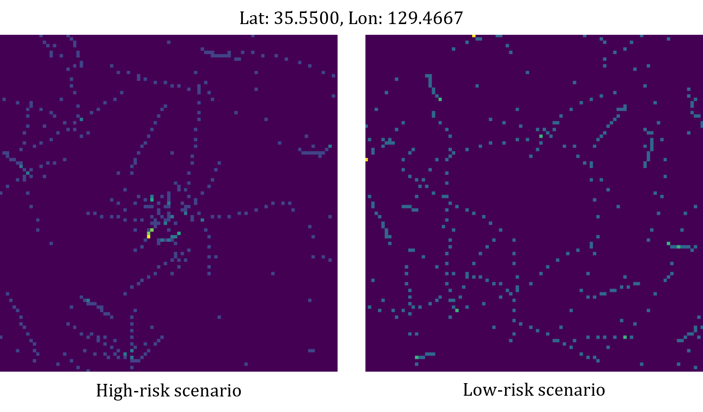

## Deep Learning Framework for Regional Maritime Collision Risk Assessment using CNN and Grad-CAM Models

### Overview

This project presents a novel deep learning framework designed to assess and interpret regional maritime collision risk in real-time. Unlike traditional methods that focus on pairwise vessel interactions (e.g., CPA, Ship Domain), this model analyzes complex, high-density traffic situations across a defined spatial region using historical Automatic Identification System (AIS) data.

The core innovation is the integration of a Convolutional Neural Network (CNN) for high-accuracy risk classification with Grad-CAM (Gradient-weighted Class Activation Mapping) for critical model interpretability.



### Problem Statement

Maritime collision risk assessment is essential for ensuring safety and efficiency in high-density waterways. Traditional methods often rely on simplified assumptions or require extensive manual feature engineering, leading to:

* Limited Spatial Feature Extraction: Difficulty in automatically identifying complex, non-linear risk patterns within a geographical area.

* Lack of Explainability: Traditional deep learning models provide predictions without explaining why a particular area is high-risk, hindering adoption by vessel traffic services (VTS) operators.

### Methodology

<ol>
<li>
Data Processing and Feature Engineering: The initial step involves transforming raw AIS data into a structured input suitable for the CNN. This is achieved through the development of the Relative Traffic Representation (RTR). The RTR discretizes the regional traffic environment into a grid, capturing multi-dimensional features such as traffic density, speed vectors, and specific spatial arrangements.

</li>

<li>
CNN-Based Risk Classification: A customized Convolutional Neural Network (CNN) is trained on the RTR inputs. The network learns complex spatial and temporal correlations within the traffic features (including the CRD metrics) to robustly classify the regional state into predefined risk levels (Low risk, High risk).

</li>

<li>
Explainable AI (XAI) and Risk Influence Distribution Map (RIDM): To ensure model transparency and practical utility, we integrate Grad-CAM (Gradient-weighted Class Activation Mapping). The Grad-CAM technique uses feature gradients to generate the Risk Influence Distribution Map (RIDM). The RIDM is a real-time heatmap that visually identifies the exact spatial locations and vessel interactions that are driving the CNN's risk prediction, offering VTS operators critical insight into why a specific risk level was assigned.

</li>

<li>
Risk Quantification via Centroid Radial Distribution (CRD): The Centroid Radial Distribution (CRD) measures the geometric dispersion of activation map. The CRD provides a quantitative metric that reflects potential collision risk.

</li>
</ol>


### Repository Structure
```
.
├── data
│   ├── geo_data    # Raw AIS data used for processing (not included, placeholder)
│   └── stat_data   # Statiscal information describing maritime aciddent
├── utils
│   └── RTR_maker.py    # Convert AIS data to RTR  
├── scripts
│   ├── 1_generate_rtr.py   # Loop for AIS data using RTR_maker.py for conversion
│   ├── 2_train_cnn.py      # Script for training the CNN model
│   ├── 3_generate_RIDM.py  # Script for generating Grad-CAM heatmaps
│   └── 4_post_proc.py      # Compilation of diverse code for visualization and results
└── README.md        
```

#### Example of dataset
The mmsi, timestamp, lat, lon, course is essential and the name should be matched exactly.
|mmsi   |Timestamp          |msg_type   |lat      |lon       |speed |course |heading|date   |
|-------|-------------------|-----------|---------|----------|------|-------|-------|-------|
|1      |2019-07-03 17:57:00|1          |35.429847|129.607267|2.2   |44.6   |150    |2019-07-03|
|1      |2019-07-03 16:10:00|1          |35.368335|129.552543|2.9   |30.2   |103    |2019-07-03|
|2      |2019-07-03 04:50:13|1          |35.092433|129.073127|0.1   |172.4  |NaN    |2019-07-03|
|3      |2019-07-03 17:50:15|1          |35.070588|129.026743|0.3   |175.8  |356    |2019-07-03|

### Reference
Official marine accident statistics is provided by the Korean Ministry of the Interior and Safety. 

### Citation